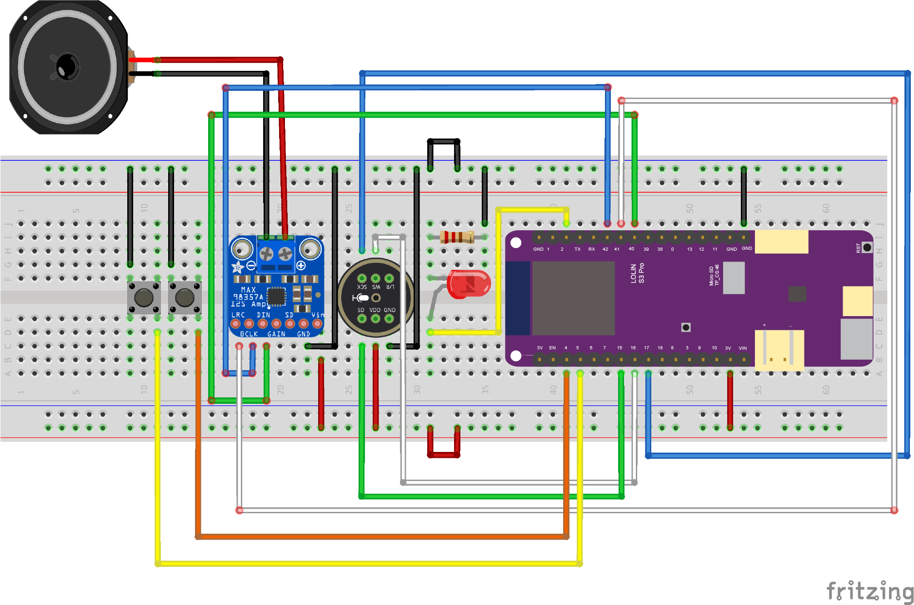

# Voice_to_chirp
Educational DIY electronics project that samples a human voice and plays it back at higher speed, making it resemble a bird call. 
It’s designed for kids to build and enjoy while discovering how electronics and sound work together.

## Usage
Download this repository.
Build the circuit using the schematics provided.
Upload the code to your board (ESP32S3 - Lolin S3 Pro).
Have fun chirping!

## Functionality
Right button: RECORD.
Left button: PLAYBACK.

When the record button is pressed the LED should turn on.
The playback speeds up the recording by a factor of 3 and plays it twice in a row.

## Hardware
We use the ESP32-S3 Lolin S3 Pro microcontroller and a few additional components:

** list of components:**
* Lolin S3 Pro
* INMP441 microphone
* MAX98357A amplifier
* LED
* 200 Ω ohm resistor
* 2x push buttons
* Jumper wires

**Connections from the MCU to:**

Amplifier:
* PIN 40 with DIN
* PIN 41 with LRC
* PIN 42 with BCLK
* GND breadboard to GND
* PIN VIN to VIN 

Microphone:
* PIN 15 with SD
* PIN 16 with WS
* PIN 17 wiht SCK
* GND breadboard to GND
* plus breadboard to VDD

LED:
* It's long leg to PIN 2
* It's short leg to the resistor 
* Resistor to the GND of the breadboard

Buttons:
* Both to GND of the breadboard
* Left button to PIN 5
* Right button to PIN 4

## Trouble shooting
Check if everything is connected the right way. Don't forget to connect the battery.
You can always uncomment a serialprint to monitor what is happening.
Sometimes the board needs to be manually booted the first time to establish a serial connection.

## Schematics
This is the full circuit diagram. 

This project was created by [Noor van Keulen](https://github.com/NvKeulen) as part of an internship.
